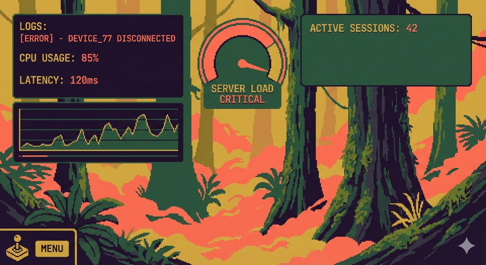
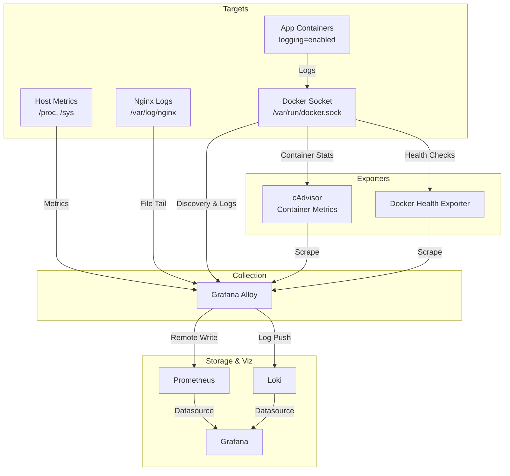

# CloudForest

Log & Metrics Aggregation Pipeline

## Architecture



- **Grafana Alloy:** Unified agent for log collection (Docker API, File), host metrics (Unix exporter), and scraping external metrics.
- **cAdvisor:** Exporter for detailed, real-time container resource usage (CPU, Memory, Network).
- **Docker Health Exporter:** Translates native Docker health checks into monitorable metrics.
- **Loki:** Centralized log storage and indexing.
- **Prometheus:** High-performance metrics storage.
- **Grafana:** Centralized visualization for logs, metrics, and generated system dashboards.

## Setup & Usage

### 1. Local Development
```bash
docker compose up -d
```
- **Grafana:** `http://localhost:3000` (admin/`${GRAFANA_PASSWORD:-changeme-now}`)
- **Prometheus:** `http://localhost:9090`
- **Alloy UI:** `http://localhost:12345`

### 2. VPS Deployment
Deployment is automated via GitHub Actions. See [OPERATIONS.md](./OPERATIONS.md) for details.

## Key Features
- **Conditional Logging:** Only containers with the label `logging=enabled` are scraped by default.
- **Host Monitoring:** Real-time metrics for CPU, Memory, Disk, and Network.
- **Container Telemetry:** Visibility into per-container resource use and native health check states.
- **Provisioned Dashboards:** Pre-configured System, Nginx, and Docker dashboards managed as code.
- **Query Library:** Common LogQL and PromQL queries documented in [QUERIES.md](./QUERIES.md).

## Enabling Logging for Containers

By default, the pipeline only scrapes logs from containers with the `logging=enabled` label.

### Docker Compose
Add the label to your service definition:
```yaml
services:
  my-app:
    image: my-app:latest
    labels:
      - "logging=enabled"
```

### Docker CLI
Pass the label when running a container:
```bash
docker run -d --label logging=enabled my-app:latest
```

## Documentation
- [OPERATIONS.md](./OPERATIONS.md): VPS setup, secrets management, and deployment.
- [DEVELOPMENT.md](./DEVELOPMENT.md): Guide for adding new features, logs, or dashboards.
- [QUERIES.md](./QUERIES.md): Categorized list of useful queries.
